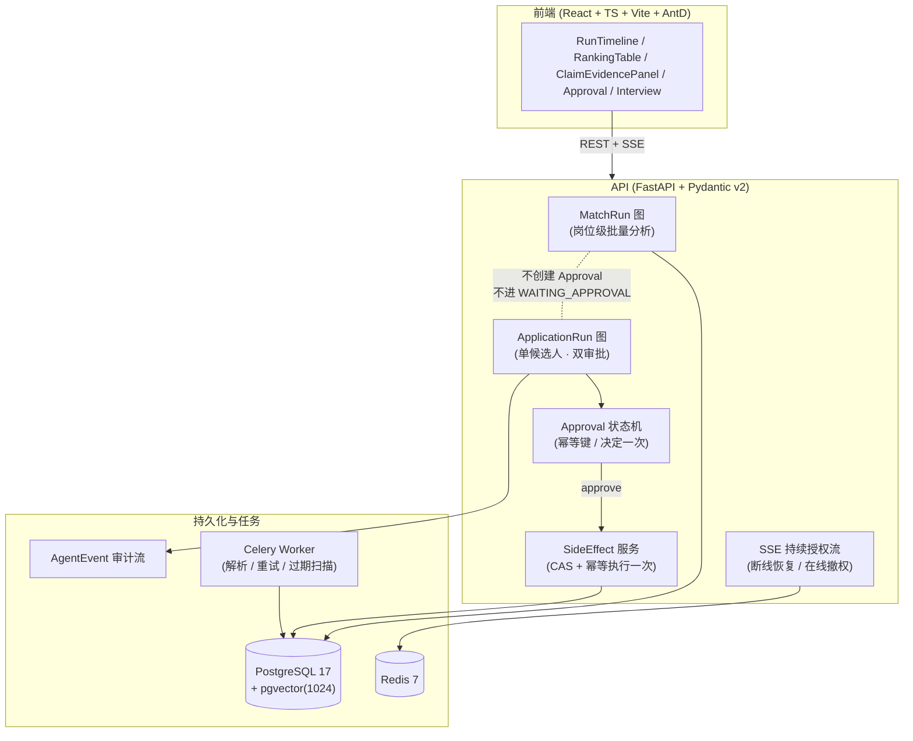

# resume-copilot

面向 HR / 招聘主管的**辅助招聘 Copilot**——不是自动招聘，而是一条**可验证的辅助决策链**：

> 整理简历 → 可评测召回 → 带证据的解释性匹配 → 批量分析与单人审批隔离 → 副作用前暂停审批 → 故障可恢复。

项目是六周单人开发的**作品集级 MVP**，目标岗位 AI Agent 开发。设计围绕三条不可妥协的硬约束展开。

## 三条硬约束（设计灵魂）

1. **证据链一等公民**：每个确定性结论必须引用 `EvidenceChunk`（精确摘录 + `SUPPORTED` / `PARTIAL` / `INSUFFICIENT`）。证据不足只能输出「不足以判断」。
2. **人工审批 + 幂等**：副作用执行前必须 `interrupt` 等人审批；未审批副作用执行次数 = 0；同一审批只决定一次。
3. **可恢复性**：Checkpoint 恢复、协作式取消、Approval 过期重试。

> 文档 / 岗位描述一律按**不可信数据**处理：它们不能改变控制流、权限或工具参数（由 IMP-027 Prompt Injection 配对评测门禁守护）。

## 架构



**单 Agent 双运行图**（隔离靠 `JobApplication` 活动 Run 排他槽 + Approval 幂等键）：

- **MatchRun**：岗位级批量分析，跑完即止——不创建 Approval、不改 `JobApplication` 状态。
- **ApplicationRun**：固定 8 节点**双审批图**（`human_review` 主中断 + `wait_schedule_approval` 条件中断）。副作用节点只埋 typed state，真正写表由 SideEffect 服务经 Approval 幂等键保证**只执行一次**。

## 技术栈

| 层 | 选型 |
|---|---|
| 前端 | React + TypeScript + Vite + Ant Design + React Flow + ECharts |
| 后端 | Python 3.12 + FastAPI + Pydantic v2 + SQLAlchemy 2 / Alembic |
| 数据库 | PostgreSQL 17 + pgvector（1024 维向量） |
| 任务 | Redis 7 + Celery |
| Agent | 基于 Checkpoint 的节点引擎（IMP-018）；采用自研 `RunEngine` 而非 LangGraph，理由见 [ADR-0001](docs/adr/0001-agent-runtime-custom-engine-over-langgraph.md) |
| 模型 | `qwen3.7-plus` + `qwen3.7-text-embedding`（OpenAI 兼容 / 百炼 SDK），默认 `MOCK_MODEL_MODE=true` |
| 部署 | Docker Compose + Nginx；GitHub Actions CI（普通 CI 用 FakeModel） |

## 快速开始（全新环境一键演示）

> 前置：Docker Desktop（含 Compose v2）+ Node 20+。约 1 分钟即可从空库跑通完整演示。

```bash
# 1) 配置环境变量（替换占位 secret）
cp .env.example .env
#   编辑 .env：JWT_SECRET 改为 ≥48 位随机串，POSTGRES_PASSWORD 设本地密码

# 2) 构建镜像并拉起依赖（PostgreSQL + Redis + API）
docker compose build
docker compose up -d

# 3) 迁移数据库（alembic upgrade head）
docker compose --profile tools run --rm migrate

# 4) 灌入合成演示数据（含 HR 账号与 5 名候选人）
docker compose --profile tools run --rm seed

# 5) 启动前端
cd apps/web && npm ci && npm run dev
#   浏览器打开 http://localhost:5173
```

登录演示账号（由 `scripts/seed_demo_data.py` 写入）：

- 用户名：`hr.demo`
- 密码：`demo-password-123`

## 演示数据流

1. **岗位**：种子已创建一个 ACTIVE 岗位「`[DEMO] 高级后端工程师（Go / Python）`」。
2. **批量匹配（MatchRun）**：在岗位页发起 MatchRun，对 5 名候选人做岗位级分析（不审批、无副作用）。
3. **单人审批（ApplicationRun）**：对单候选人发起 ApplicationRun：
   - 在 `human_review` 中断处停留，**必须 HR 审批**才能继续；
   - 若进入排期阶段，在 `wait_schedule_approval` 二次中断，**再次审批**才写面试；
   - 所有副作用经 Approval 幂等键保证**只执行一次**（可观测性 `/metrics` 记录 401/403/409）。
4. **面试与完成**：审批通过后生成 Interview，Run 进入 `COMPLETED`，活动槽释放。

## 配置

所有配置见 `.env.example`。关键项：

| 变量 | 说明 |
|---|---|
| `JWT_SECRET` | ≥48 位随机串（生产必改） |
| `DATABASE_URL` / `REDIS_URL` | 默认指向 Compose 服务名 `postgres` / `redis` |
| `MOCK_MODEL_MODE` | `true` 时走确定性 FakeModel，无需真实 API Key 即可演示 |
| `EMBEDDING_DIMENSION` | 必须与 embedding 模型一致，默认 `1024` |
| `APPROVAL_TTL_MINUTES` | Approval 过期扫描窗口（由 Celery Beat 周期触发） |
| `STORAGE_ROOT` | 简历存储根（Compose 中挂载为卷） |

## 合成演示数据

`scripts/seed_demo_data.py` 通过应用自身的 ORM 模型直接写入（repository 的 `save` 即 `session.add`），严格遵守所有外键链：

- 1 个 HR 用户（已知凭据）+ 1 个 ACTIVE 岗位（含 `JobVersion` 与 `JobAssignment`）；
- 5 名候选人，各含 1 个 `READY` Profile 与 3 条 `EvidenceChunk`（确定性 1024 维 embedding）；
- 重跑安全：`docker compose --profile tools run --rm seed -- --reset` 先按标记清理再重新灌入。

> embedding 为**合成确定性向量**（由文本哈希生成），使向量召回可在离线（FakeModel）下复现；真实部署应改用配置的 embedding 网关重新生成。

## 开发与验证

```bash
# 后端质量门禁（容器内）
docker compose --profile tools run --rm --build api pytest -q
# 或本地：pip install -r requirements.lock && ruff check backend && mypy backend && pytest

# 前端
cd apps/web && npm run typecheck && npm run test && npm run build

# 端到端门禁 G6：解析/检索/证据/Tool/Prompt Injection 指标达到发布门槛
pwsh scripts/project.ps1 verify
```

`scripts/project.ps1` 提供编排动作：`bootstrap` / `api` / `web` / `seed` / `reset-demo` / `backend-test` / `verify` 等。

## 项目结构

```
backend/app/        # FastAPI 后端：auth / jobs / documents / candidates
                    #   / retrieval / agent / match_run / job_applications
                    #   / approvals / interviews / reports / sse / evaluations
backend/app/core/   # settings / logging(脱敏) / metrics / context / middleware / health
migrations/         # Alembic 迁移（支持空库升级）
apps/web/           # React + TS 前端
scripts/            # 环境脚本 + 演示数据 seed
tests/unit/         # 单元测试（含 IMP-027 配对评测 / IMP-028 并发恢复回归）
compose.yaml        # 本地 / 演示编排
```

## 实现进度（IMP-001 ~ IMP-030）

| 阶段 | 状态 |
|---|---|
| IMP-001 ~ IMP-026 核心闭环 | ✅ 已提交 |
| IMP-027 Prompt Injection 配对评测 | ✅ 已提交 |
| IMP-028 E2E / 故障恢复 / 并发回归 | ✅ 已提交 |
| 预存测试失败修复（pydantic 2.13 / anyio） | ✅ 已提交 |
| IMP-029 观测 / 性能 / 健康 / 脱敏 | ✅ 已提交 |
| **IMP-030 README / 演示数据 / 脚本 / 发布** | ✅ 本仓库 |

## MVP 边界

- 电子 PDF / DOCX（无 OCR）、合成数据、单机、MockSchedule、精确向量检索（HNSW 不默认启用）、Langfuse 可选。
- 未审批副作用执行次数 = 0；RBAC 服务端每次重校验；SSE 每批 / 心跳持续授权。

## 说明

本仓库为作品集级 MVP，用于展示「可验证的辅助决策链」设计：证据归属、审批隔离、可恢复性均落到可自动化评测的门禁中。
