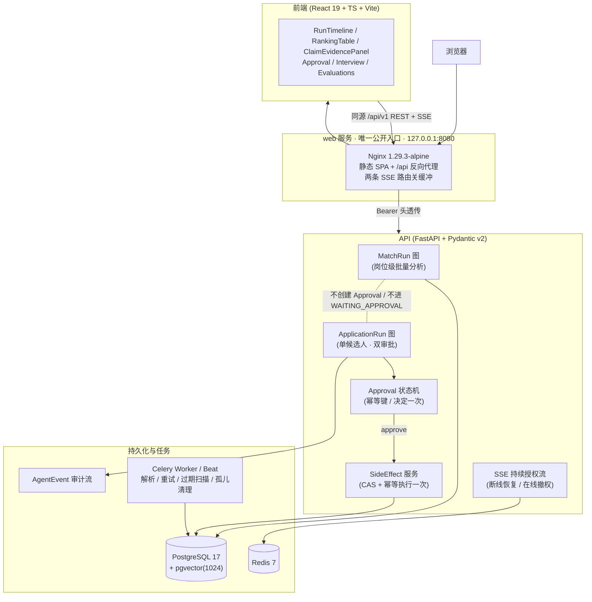

# resume-copilot

面向 HR / 招聘主管的**辅助招聘 Copilot**——不是自动招聘，而是一条**可验证的辅助决策链**：

> 整理简历 → 可评测召回 → 带证据的解释性匹配 → 批量分析与单人审批隔离 → 副作用前暂停审批 → 故障可恢复。

项目是六周单人开发的**作品集级 MVP**，目标岗位 AI Agent 开发。设计围绕三条不可妥协的硬约束展开。

面向求职作品集的下一轮改进见 [后续开发计划](./后续开发计划.md)，包含 2026-09-18 的代码现状复核、优先级、验收标准和发布安排。

## 三条硬约束（设计灵魂）

1. **证据链一等公民**：每个确定性结论必须引用 `EvidenceChunk`（精确摘录 + `SUPPORTED` / `PARTIAL` / `INSUFFICIENT`）。证据不足只能输出「不足以判断」。
2. **人工审批 + 幂等**：副作用执行前必须 `interrupt` 等人审批；未审批副作用执行次数 = 0；同一审批只决定一次。
3. **可恢复性**：Checkpoint 恢复、协作式取消、Approval 过期重试。

> 文档 / 岗位描述一律按**不可信数据**处理：它们不能改变控制流、权限或工具参数（由 IMP-027 Prompt Injection 配对评测门禁守护）。

## 模型与规则边界

这个项目最容易被误读的地方，是「LLM 参与招聘判断」听起来像模型在做决定。**不是**：决定由确定性规则做，模型只负责它真正擅长的那部分，两者在数据、代码和界面上都是分开的。

| | 规则层（确定性，无模型） | 模型层（可替换，有不确定性） |
|---|---|---|
| 负责 | 硬性条件判定（学历 / 年限 / 必备技能 → `PASS` / `FAIL` / `UNKNOWN`）；综合分的排序换算；支持等级分级；面试题模板 | 简历字段抽取草稿；向量召回；对结论的自然语言解释 |
| 不负责 | 不解释、不措辞、不做语义判断 | **不决定**是否入围、不改申请状态、不产生副作用、不改变控制流 / 权限 / 工具参数 |
| 产物标记 | `claim.source = RULE`，支持等级可达 `SUPPORTED` | `claim.source = MODEL`，支持等级**上限 `PARTIAL`** |
| 版本 | `RULE_VERSION` | `PROMPT_VERSION` + 对话 / 向量模型名 |

三条由此推出的硬性结论：

1. **综合分不是模型置信度**。它是检索排序的换算分（满分 100），报告与界面都显式标注，避免读者把排序当成模型「有多确信」。
2. **模型解释永远不会显示为「支持」**。引用合法只证明「这句话确实在原文里」，不证明「原文支持这个结论」；模型要求 `HIGH` 影响被当作**契约违规**拒绝，而不是悄悄夹取——否则模型就能用「合法引用 + 高影响」绕过守卫表达决定性判断。
3. **抽取结果必须经人工校对才生效**。模型产出的是草稿，HR 确认后才标 `READY`，后续匹配只用 `READY` 档案。

**Mock 模式证明什么**：默认 `MOCK_MODEL_MODE=true`，用确定性替身（`fake-v1` / `fake-embed-v1`）跑全链路。它能证明的是**流程、契约、失败语义与可复现性**——门禁会触发、非法引用会被拒、审批绕不过去、同一输入每次得到同一结果。它**不能**证明真实模型的抽取质量、检索效果或抗注入能力，报告里每个数字都带自己的适用范围说明。真实模型入口已就绪（`python scripts/run_evaluation.py --live --max-calls N`），缺的是凭据与预算，不是机制。当前模型模式在**每个页面顶部**都有横幅写明，不需要靠文档推断。

## 架构



**单 Agent 双运行图**（隔离靠 `JobApplication` 活动 Run 排他槽 + Approval 幂等键）：

- **MatchRun**：岗位级批量分析，跑完即止——不创建 Approval、不改 `JobApplication` 状态。
- **ApplicationRun**：固定 8 节点**双审批图**（`human_review` 主中断 + `wait_schedule_approval` 条件中断）。副作用节点只埋 typed state，真正写表由 SideEffect 服务经 Approval 幂等键保证**只执行一次**。

**Nginx 是唯一公开入口**：前端只发同源请求（`/api/v1/...`），由代理决定上游，因此同一份静态产物可部署到任意环境。API 与数据库端口即使在本地也只绑定 `127.0.0.1`。

**写入路径只有一条**：ApplicationRun 的副作用节点只产出 typed state，真正写表的是 `Approval` 决定之后由 `SideEffect` 服务执行的动作。因此「恢复之后不会多写一次」是可以被断言的事实，而不是设计意图——证据见 [`docs/release/no-duplicate-write.md`](./docs/release/no-duplicate-write.md)（含三层独立守卫、断言位置与复现命令）。

同一张架构图的独立渲染版本（可放进幻灯片 / PDF，不依赖 Mermaid 渲染器）：[`docs/architecture.svg`](./docs/architecture.svg)。

## 技术栈

| 层 | 选型 |
|---|---|
| 前端 | React 19 + TypeScript 5.9 + Vite 7 + React Router 7 + TanStack Query 5 + Zustand 5（组件与样式自研，不引入 UI 组件库） |
| 后端 | Python 3.12.14 + FastAPI 0.141 + Pydantic 2.13 + SQLAlchemy 2 / Alembic |
| 数据库 | PostgreSQL 17 + pgvector（1024 维向量，镜像 digest 固定） |
| 任务 | Redis 7.4 + Celery 5.6（Worker + Beat） |
| Agent | 基于 Checkpoint 的节点引擎（IMP-018）；采用自研 `RunEngine` 而非 LangGraph，理由见 [ADR-0001](./docs/adr/0001-agent-runtime-custom-engine-over-langgraph.md) |
| 模型 | `qwen3.7-plus` + `qwen3.7-text-embedding`（OpenAI 兼容），默认 `MOCK_MODEL_MODE=true` |
| 入口 | Nginx 1.29.3-alpine（由 `web` 服务的运行时阶段提供，无独立 nginx 服务） |
| 编排 | Docker Compose + GitHub Actions（普通 CI 全程 FakeModel，无外部凭据） |

## 关键指标（可复现）

下面这组数字来自保留评测集（`HOLDOUT`，36 例），由 `python scripts/run_evaluation.py` 在**实际链路**上跑出来——抽取经配置的网关，召回走 `RetrievalService` 与 RRF 融合，硬性规则走 `evaluate_hard_rules`，报告走 `build_candidate_report`，没有任何环节被重新实现。

| 环节 | 指标 | 数值 |
|---|---|---|
| 抽取（字段级） | skills 精确率 / 召回率 / F1 | 1.000 / 0.882 / 0.938 |
| 抽取（字段级） | 字段 F1 均值 | **0.979**（唯一缺口是 4 例刻意的词表外技能） |
| 检索 | Recall@5 / MRR / nDCG@5 | 0.625（上限 0.833）/ **1.000** / 0.815 |
| 支持标签 | 宏平均 F1 / 宏平均精确率 | **1.000** / **1.000**（144 个结论，三档标签均被覆盖） |
| 硬性条件 | 规则一致率 | **1.000**（确定性环节不设阈值：不一致即语料或规格发生了移动） |
| 注入（系统侧） | 越权 / 副作用 / 审批绕过放行数 | **0 / 17**（门槛 0，覆盖 10 类攻击） |
| 注入（模型侧） | 模型遵循攻击内容 | 5 / 17 —— 该计数**允许非零**，且替身读数不可外推 |
| 计分器测试 | 全部 12 项阈值 | 通过（只证明计分器与阈值行为未变，不作为系统能力证据） |

**这些数字的边界**（每个数字在报告里都带自己的适用范围说明，不是免责套话）：

- Recall@5 的分母是「相关候选数」而非「命中数」，K 小于相关数时**数学上到不了 1**。报告里写明每个岗位的上限（0.833），所以 0.625 与上限比才有意义，与 1 比没有。
- 抽取与语义指标受**替身词表**限制，不可外推到真实模型；可直接引用的是链路是否通、确定性环节是否正确。
- 「模型遵循 5/17」与「系统放行 0/17」是**两个不同的测量**，合并成一个数字会让二者互相掩护。前者只统计模型对候选人字段的断言（原文里的攻击文本被原样捕获不算「遵循」），后者才是失守。
- 报告按来源分节（计分器测试 / 假模型 / 录制回放 / 真实模型），`combine` 对来源不同的指标直接抛错——**不允许把不同来源的数字平均**，那会得到一个不描述任何一次运行的结果。

**复现步骤**：

```bash
# 1) 拉取代码并准备环境（只需 Docker Desktop；本机不需要 Python）
git clone <repo> && cd resume-copilot

# 2) 离线评测：默认确定性替身，无网络、无凭据、无外部依赖
python scripts/run_evaluation.py --k 5 --split holdout

#    想留存报告（会写入上面的「溯源」块：commit、生成时间、本次命令）
python scripts/run_evaluation.py --k 5 --split holdout --output docs/evaluation/report-holdout.md

#    回放已录制的响应，走真实解析与校验路径
python scripts/run_evaluation.py --recording tests/fixtures/recordings/extraction.json

#    真实模型评测（需要端点与凭据，且必须声明调用预算）
python scripts/run_evaluation.py --live --max-calls 200
```

退出码是契约：`0` 通过、`1` 无法得出结论（语料为空 / 无录制 / 没测到任何用例）、`2` 无法开始、`3` 门槛未通过。**测不出结论时必须退出非零**，不允许「零攻击成功是因为没有攻击」。

一份带完整溯源的实测报告：[`docs/evaluation/report-holdout.md`](./docs/evaluation/report-holdout.md)（报告中写明它是哪个 commit 生成的；换了提交就要重测，不能与旧报告并列比较）。

## 快速开始

前置只需要 **Docker Desktop（含 Compose v2）**。Node 22 不是演示必需的——前端在镜像内由固定 Node 版本构建。

```bash
# Windows 日常启动：无需安装 PowerShell 7，也不修改系统执行策略
.\start.cmd
#   入口：http://localhost:8080
```

`start.cmd` 只对这一次进程绕过 PowerShell 执行策略，然后调用同目录的 `start.ps1`；不会修改机器的永久执行策略。启动器首次运行会自动生成 `.env`，默认保留已有容器卷和业务数据，重复运行是安全的。为避开本机已有开发服务，API、PostgreSQL 和 Redis 的宿主调试端口默认自动分配，公开入口仍固定为 `8080`；需要固定调试端口时可传 `-ApiPort 8000 -PostgresPort 5433 -RedisPort 6380`。其他可选参数可直接透传，例如 `.\start.cmd -OpenBrowser`、`.\start.cmd -ResetDemo` 或 `.\start.cmd -Fresh`；`-Fresh` 与 `-ResetDemo` 不能同时使用。

底层的 `scripts/start_stack.ps1` 是全新环境验证脚本：它拒绝复用残留资源、把 seed 连跑两次验证幂等，并默认在验证后连卷拆除；需要直接使用时加 `-KeepRunning` 才会保留栈。

手工等价步骤：

```bash
docker compose build api web
docker compose up -d --wait          # migrate 在默认 profile，api 以 service_completed_successfully 等它
docker compose --profile tools run --rm seed
# 浏览器打开 http://localhost:8080
```

## 演示入口与账号

| 入口 | 地址 | 说明 |
|---|---|---|
| 公开入口 | `http://localhost:8080` | Nginx 提供静态 SPA 并反代 `/api/`；`/healthz` 由 Nginx 自答 |
| API 调试 | `http://127.0.0.1:8000` | 直接运行 Compose 时的默认值；`start.cmd` 自动选择空闲端口，或用 `-ApiPort` 固定 |
| PostgreSQL 调试 | `127.0.0.1:5433` | 直接运行 Compose 时的默认值；`start.cmd` 自动选择空闲端口，或用 `-PostgresPort` 固定 |
| Redis 调试 | `127.0.0.1:6380` | 直接运行 Compose 时的默认值；`start.cmd` 自动选择空闲端口，或用 `-RedisPort` 固定 |

演示账号由 `scripts/seed_demo_data.py` 写入，是**合成数据的固定凭据**（只对本地演示库有效，不含任何真实账号）：

- 用户名：`hr.demo`
- 密码：`demo-password-123`

## 演示数据流

1. **岗位**：种子已创建一个 ACTIVE 岗位「`[DEMO] 高级后端工程师（Go / Python）`」。
2. **批量匹配（MatchRun）**：在岗位页发起 MatchRun，对 5 名候选人做岗位级分析（不审批、无副作用）。
3. **单人审批（ApplicationRun）**：对单候选人发起 ApplicationRun：
   - 在 `human_review` 中断处停留，**必须 HR 审批**才能继续；
   - 若进入排期阶段，在 `wait_schedule_approval` 二次中断，**再次审批**才写面试；
   - 所有副作用经 Approval 幂等键保证**只执行一次**（`/api/v1/metrics` 记录 401/403/409）。
4. **面试与完成**：审批通过后生成 Interview，Run 进入 `COMPLETED`，活动槽释放。

## 演示 / 重置 / 诊断命令

| 目的 | 命令 | 说明 |
|---|---|---|
| 全量门禁 | `pwsh scripts/project.ps1 verify` | 与 CI 完全同一入口（CI 也只是调用它），串起静态探针、Ruff、mypy strict、pytest、离线评测门禁、前端 typecheck/vitest/build、Playwright 与两条活栈探针。需要 `pwsh`。 |
| 一键起停 | `pwsh scripts/start_stack.ps1 [-KeepRunning]` | 全新 clone/Volume 路径；结束默认清理。 |
| 起栈（保留数据） | `docker compose up -d --wait` | 迁移随默认 profile 自动执行。 |
| 灌演示数据 | `pwsh scripts/project.ps1 seed` | 幂等；第二次运行是 no-op。 |
| 重置演示数据 | `pwsh scripts/project.ps1 reset-demo` | 等价 `seed -- --reset`：按演示标记清理后重新灌入。 |
| 入口存活 | `curl.exe -i http://localhost:8080/healthz` | Nginx 自答 `ok`；API 挂掉时它仍返回 200，这是刻意设计。 |
| 依赖就绪 | `curl.exe http://localhost:8080/api/v1/health/ready` | 经代理打到 API，覆盖 PostgreSQL / Redis / Storage。 |
| 指标 | `curl.exe http://localhost:8080/api/v1/metrics` | 进程内指标（含 401/403/409 计数）。 |
| 真实模型诊断 | `python -m backend.app.infrastructure.model_diagnose` | 退出码 0=可达 / 1=永久失败 / 2=临时失败；端点做归一化，**绝不打印凭据**。 |
| 离线评测门禁 | `python -m backend.app.evaluations.gate` | 退出码 0=通过 / 1=阈值未达标 / 2=飞架故障；刻意不读 `Settings`，可在裸 CI 步骤独立运行。 |
| 看日志 | `docker compose logs -f api worker scheduler` | Worker / Scheduler 不设 Docker healthcheck，就绪性由探针日志断言。 |
| 彻底清理 | `docker compose --profile tools down --volumes --remove-orphans` | **必须带 `--profile tools`**：`storage-init` 在该 profile 内，漏掉它就删不掉它持有的 `resume_storage` 卷。 |
| Docker 自愈 | `pwsh scripts/project.ps1 docker-recover` | 只把冲突目录/设置文件改名备份，不删镜像、容器数据或 VHDX。 |

## 开发与验证

```bash
# 后端质量门禁（容器内，本机无需 Python 环境）
pwsh scripts/project.ps1 backend-test        # = docker run --rm resume-copilot-backend-development:local pytest -q
pwsh scripts/project.ps1 backend-lint        # ruff
pwsh scripts/project.ps1 backend-typecheck   # mypy strict

# 前端
pwsh scripts/project.ps1 web-typecheck
pwsh scripts/project.ps1 web-test
pwsh scripts/project.ps1 web-e2e             # Playwright（需要活栈）

# 前端热重载开发（可选）：另起 API 并放开 CORS
pwsh scripts/project.ps1 web                 # http://localhost:5173，需 CORS_ORIGINS 含该源
```

`scripts/project.ps1` 的动作全集：`bootstrap` / `env-init` / `env-test` / `api` / `api-smoke` / `auth-test` / `compose-test` / `job-test` / `document-upload-test` / `application-entry-test` / `nonseed-flow-test` / `nginx-proxy-test` / `one-command-up-test` / `parser-test` / `migration-test` / `seed` / `reset-demo` / `web` / `backend-lint` / `backend-typecheck` / `backend-test` / `web-typecheck` / `web-test` / `web-build` / `web-e2e` / `verify` / `docker-recover` / `docker-recover-test`。

## 配置

所有配置见 `.env.example`。关键项：

| 变量 | 说明 |
|---|---|
| `JWT_SECRET` | ≥48 位随机串（生产必改） |
| `DATABASE_URL` / `REDIS_URL` | 默认指向 Compose 服务名 `postgres` / `redis` |
| `MOCK_MODEL_MODE` | `true` 时走确定性 FakeModel，无需真实 API Key 即可演示 |
| `MODEL_BASE_URL` / `QWEN_API_KEY` | 真实模型端点与凭据，由 Compose 透传给 API / Worker / Scheduler。`MOCK_MODEL_MODE=false` 时二者必填，缺失即启动失败；空值按「未配置」处理，不会退化成空端点 |
| `CHAT_MODEL` / `EMBEDDING_MODEL` / `EMBEDDING_DIMENSION` | 模型名与向量维度 |
| `EMBEDDING_DIMENSION` | 必须与 embedding 模型一致，默认 `1024` |
| `APPROVAL_TTL_MINUTES` | Approval 过期扫描窗口（由 Celery Beat 周期触发） |
| `STORAGE_ROOT` | 简历存储根（Compose 中挂载为卷） |
| `WEB_HOST_PORT` / `API_HOST_PORT` / `POSTGRES_HOST_PORT` / `REDIS_HOST_PORT` | 宿主侧调试端口，被 `compose.override.yaml` 使用 |

> `SSE_HEARTBEAT_SECONDS` 由 `compose.yaml` 转发，所以 `.env.example` 里的值就是容器实际取值（默认 `1` 秒）。心跳同时是撤权通知的载体：API 在每个心跳重新校验授权，缩短它才能让在线撤权在一次心跳内可见。

## 合成演示数据

`scripts/seed_demo_data.py` 通过应用自身的 ORM 模型直接写入（repository 的 `save` 即 `session.add`），严格遵守所有外键链：

- 1 个 HR 用户（已知凭据）+ 1 个 ACTIVE 岗位（含 `JobVersion` 与 `JobAssignment`）；
- 5 名候选人，各含 1 个 `READY` Profile 与 3 条 `EvidenceChunk`（确定性 1024 维 embedding）；
- 重跑安全：`docker compose --profile tools run --rm seed -- --reset` 先按标记清理再重新灌入。

> embedding 为**合成确定性向量**（由文本哈希生成），使向量召回可在离线（FakeModel）下复现；真实部署应改用配置的 embedding 网关重新生成。

## 基线与规模

| 项 | 值 |
|---|---|
| 后端 | 177 个 Python 文件（`backend/`）/ 约 28.6k 行；`ruff` 干净，`mypy` strict 通过 247 个文件 |
| 后端测试 | `pytest -q` → **886 passed**（+17 项 PostgreSQL/Redis 集成用例在无 `DATABASE_URL` 时按设计跳过，由探针栈内执行）。配置单测已与本地 `.env` 隔离，有无本地配置结论一致 |
| 前端 | 82 个 `.ts` / `.tsx` / 约 10.1k 行；`tsc -b` 干净，`vitest` 31 个测试文件 **239 passed**，`vite build` 通过 |
| E2E | 5 个 Playwright spec（含 FIN-010 非种子主路径、FIN-011 故障与安全矩阵） |
| 迁移 | 13 个 Alembic 版本，head `0013_match_explanations`，26 张表 |
| 探针 | `tests/` 下 25 个受版本控制的 PowerShell 探针，其中 **23 个接入 `project.ps1 verify`**。另 2 个是 Gate 0 的宿主环境探针（`validate_container_runtime.ps1` / `validate_environment_setup.ps1`，见 [`环境配置清单.md`](./环境配置清单.md) §5.1）：它们验证本机 Docker/WSL 与 Windows 宿主配置，因此在开发机上跑，不进 CI |
| 运行时 | Python 3.12.14 / Node 22.23.2 / PostgreSQL 17 + pgvector / Redis 7.4-alpine / Nginx 1.29.3-alpine（镜像全部固定 tag 或 digest，无 `latest`） |

## 实现进度

| 阶段 | 状态 |
|---|---|
| IMP-001 ~ IMP-030（工程骨架到发布） | ✅ 全部提交 |
| FIN-001 ~ FIN-012（幂等、Worker 基线、文档闭环、前端闭环、异步恢复、维护任务、评测、真实适配器、运行时 ADR、非种子主路径、故障矩阵、完整 Compose 与 CI） | ✅ 全部 DONE，逐项证据见 [`编码实现计划.md`](./编码实现计划.md) §20.2 / §20.3 |
| FIN-013 发布收口 | ✅ 全部 DONE：README 与环境清单校准、CI run 35066318081 全绿（含 `project.ps1 verify` 全量）、Secret/隐私扫描与依赖审计干净、`ONE_COMMAND_UP_VALIDATION_OK` / `API_RUNTIME_VALIDATION_OK` / `NGINX_PROXY_VALIDATION_OK`、release commit + `v1.0.0` tag |
| PORT-001 运行配置、依赖与测试隔离 | ✅ DONE：`httpx2` 纳入运行依赖并同步双锁文件；模型端点、凭据、模型名、超时、向量维度与 SSE 心跳由 Compose 透传；配置单测与本地 `.env` 隔离；README 与环境清单口径校准。验收证据见 [`后续开发计划.md`](./后续开发计划.md) §5 |
| PORT-002 逐项证据绑定与评分语义 | ✅ DONE：报告结论不再默认引用第一条证据，改为按观测值在候选人原文中定位（学历等级归一化到同一序数表、技能按词边界匹配、年限要求精确等值），定位不到即降级支持等级并在文案与 `confidence_note` 中说明；分数明确标注为「检索排序换算分（非模型置信度）」。验收证据见 [`后续开发计划.md`](./后续开发计划.md) §5 |
| PORT-003 真实模型匹配解释闭环 | ✅ DONE（首个验收项待凭据）：新增封闭的模型解释契约（`extra="forbid"`、`impact` 仅 `LOW/MEDIUM`，模型要求 `HIGH` 判为契约违规而非夹取）、Qwen 解释适配器与确定性 Fake；模型引用在持久化前经服务端反查切片并走同一套 §9.4 校验，模型结论支持等级上限为 `PARTIAL`；429 / 超时 / Schema 错误 / 非法引用各有独立 `reason_code`，模型故障不影响 run 终态、不触发审批或副作用；`match_explanations` 记录模型、Prompt、规则版本、耗时、重试与可获得的 Token usage，报告结论以 `source` 区分规则判定与模型解释。验收证据见 [`后续开发计划.md`](./后续开发计划.md) §5 |
| PORT-004 实际输出评测与录制回放 | ✅ DONE（真实模型项待凭据）：52 例由原始简历文本与岗位输入驱动的评测集（13 类画像 × 4 类岗位，DEV/HOLDOUT 分离），标准答案独立标注；预测由真实链路产生（网关抽取 → 召回 → 硬性规则 → 报告 → 真实 `ApplicationRun` 图），并按 `SCORER_FIXTURE` / `FAKE_MODEL` / `RECORDED_REPLAY` / `LIVE_MODEL` 分开报告、拒绝合并；28 组原始 clean / injected 文本对走同一条链路，「模型是否遵循攻击内容」与「系统是否放行越权 / 副作用 / 审批绕过」分别记录；空语料、缺录制、门禁不可达、超出调用预算一律失败退出。`python scripts/run_evaluation.py --k 5 --split holdout` 为唯一入口。验收证据见 [`后续开发计划.md`](./后续开发计划.md) §5 |
| PORT-005 关键页面与演示体验 | ✅ DONE（浏览器与投屏项未执行）：排名与报告以候选人姓名和事实摘要呈现，Profile ID 降为「辅助追踪」；每条证据标出页码 / 段落并可直接打开原文定位（`?chunk=`），证据属于旧版本时明说而不是静默失败；时间线只显示可读节点名、状态与失败原因，事件类型 / 消息键 / 载荷收进辅助详情；审批页按「拟执行动作 → 原提案与参数 → 当前版本 → 执行结果」组织，并区分「决策已记录但尚未写入」（`APPROVED` / `EDITED`）与「恰好落库一次」（`EXECUTED`）；`GET /api/v1/runtime/model-mode` 在每页顶部标明当前是真实模型还是 Mock 及其证明范围，报告标出结论来源，错误与终态各自给出恢复指引。**关键浏览器场景与实际投屏分辨率检查因本机无法启动 Docker 未执行，两项验收保持未勾选**。验收证据见 [`后续开发计划.md`](./后续开发计划.md) §5 |
| PORT-006 作品集材料与发布验收 | ✅ DONE：评测报告新增**溯源块**（commit、工作区是否干净、生成时间、实际命令），不可读时写「未记录」而不是省略，工作区不干净时不会被当成干净提交；[`docs/evaluation/report-holdout.md`](./docs/evaluation/report-holdout.md) 为受版本控制的实测报告；README 补「模型与规则边界」（规则层决定、模型层贡献，各自能被什么证明）与「关键指标（可复现）」（数字带适用边界 + 复现步骤 + 退出码契约）；[`docs/architecture.svg`](./docs/architecture.svg) 为不依赖 Mermaid 的独立架构图；[`docs/release/no-duplicate-write.md`](./docs/release/no-duplicate-write.md) 为「恢复后没有重复写入」案例（三层独立守卫 + 断言位置 + 复现命令）；[`演示脚本.md`](./演示脚本.md) 拆成 **5 分钟录屏版**与 **10 分钟现场版**，并新增「Mock 模式的验证范围」一节。发布验收记录见 [`docs/release/verification.md`](./docs/release/verification.md) |

## MVP 边界

- 电子 PDF / DOCX（无 OCR）、合成数据、单机、MockSchedule、精确向量检索（HNSW 不默认启用）、Langfuse 可选。
- 未审批副作用执行次数 = 0；RBAC 服务端每次重校验；SSE 每批 / 心跳持续授权。
- 尚未闭环的两项：真实百炼凭据下的模型诊断与真实模型评测（入口已就绪：`python scripts/run_evaluation.py --live --max-calls N`，缺的是凭据与预算确认，不是机制）；手动的真实模型 CI 工作流。运行镜像的模型依赖与配置透传已补齐（PORT-001），关掉 mock 时会解析到真实网关，缺凭据则在启动阶段明确失败，而不是悄悄退回 FakeModel。
- `SSE_HEARTBEAT_SECONDS` 由 Compose 转发，`.env.example`、Compose 默认值与代码默认值统一为 1 秒。

## 版本口径

三处版本号彼此独立，不要互相推导：

- **发布标签** `v1.0.0` 标记 FIN-013 发布收口那次提交，是本仓库的第一个演示基线快照。`v1.1.0` 标记 PORT-001~006 这一轮改进的收口提交（新增模型模式端点、证据直达原文、审批页信息完整、评测报告溯源、演示材料双版本）。
- **后端包**（`pyproject.toml`）与**前端包**（`apps/web/package.json`）的版本号均为 `0.1.0`，是随 PORT 系列继续迭代的工作版本，不随发布标签走。
- **API 版本**是路径前缀 `/api/v1`（`API_BASE_PATH`），属于 HTTP 契约，与上面两个包版本无关。

## 说明

本仓库为作品集级 MVP，用于展示「可验证的辅助决策链」设计：证据归属、审批隔离、可恢复性均落到可自动化评测的门禁中。运行时选择（自研 `RunEngine` 而非 LangGraph）是一次**正式接受的设计偏差**，记录在 [ADR-0001](./docs/adr/0001-agent-runtime-custom-engine-over-langgraph.md)。
