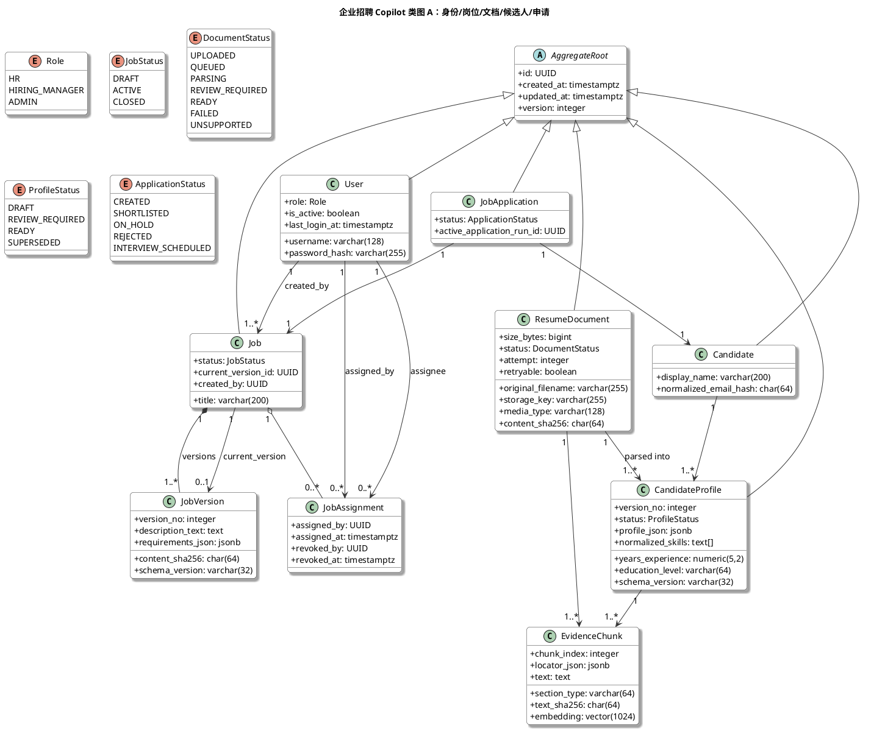
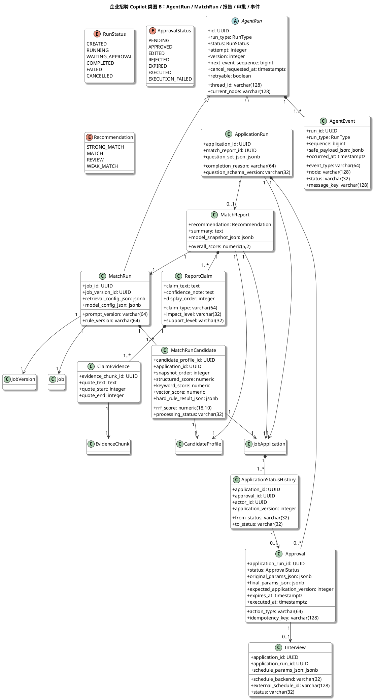
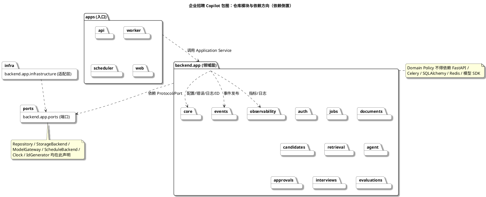
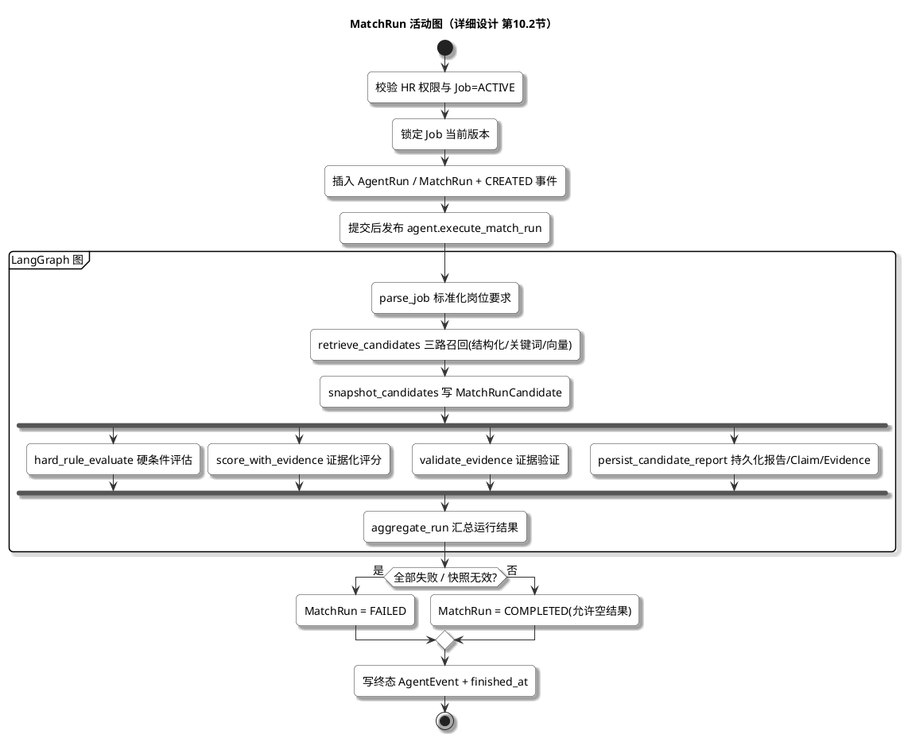
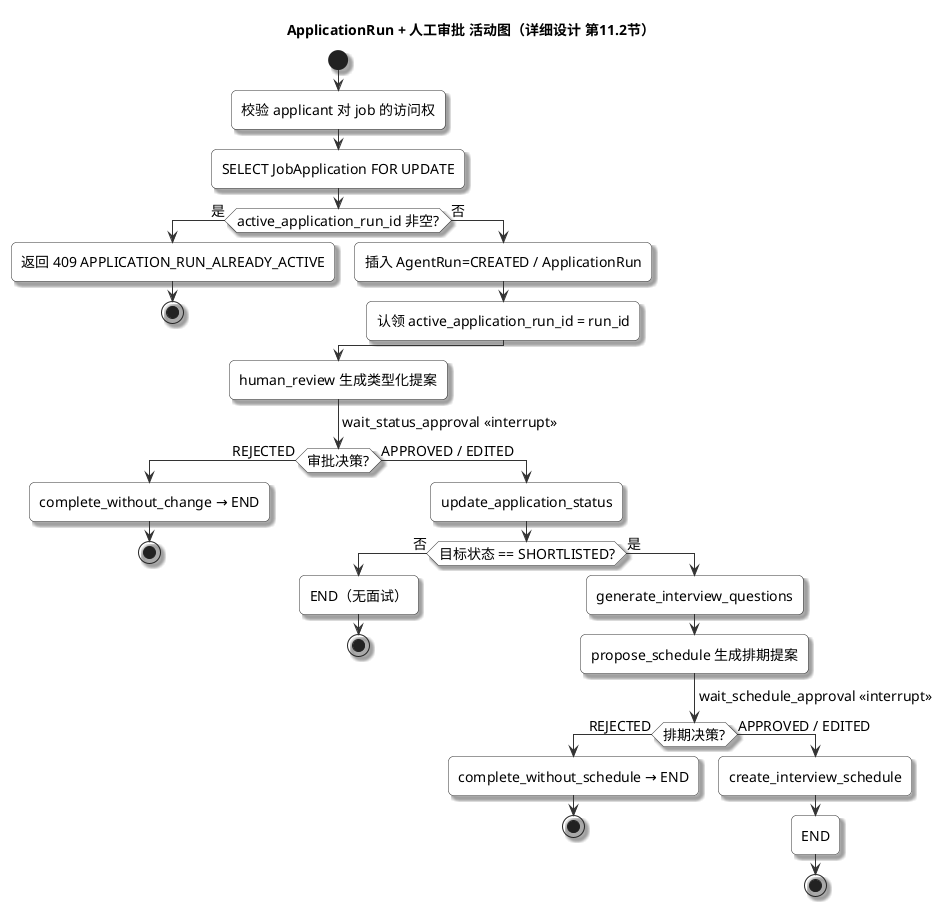
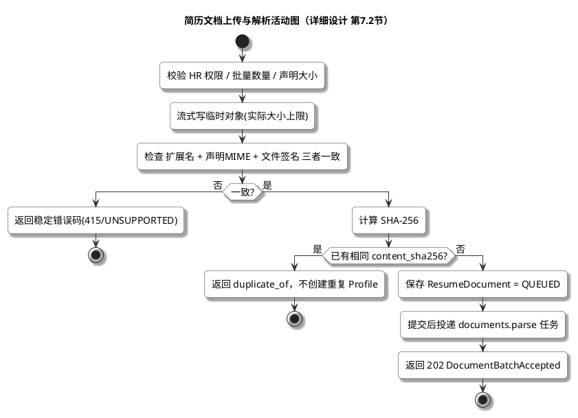
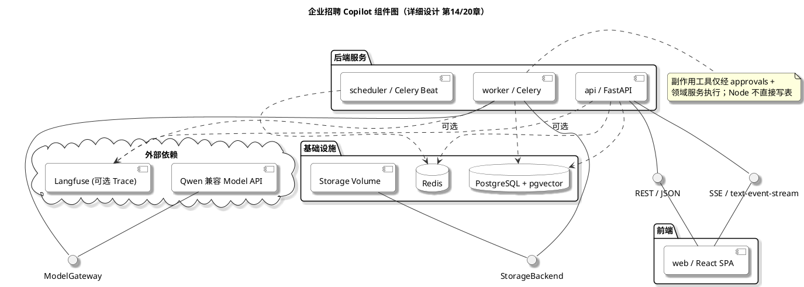
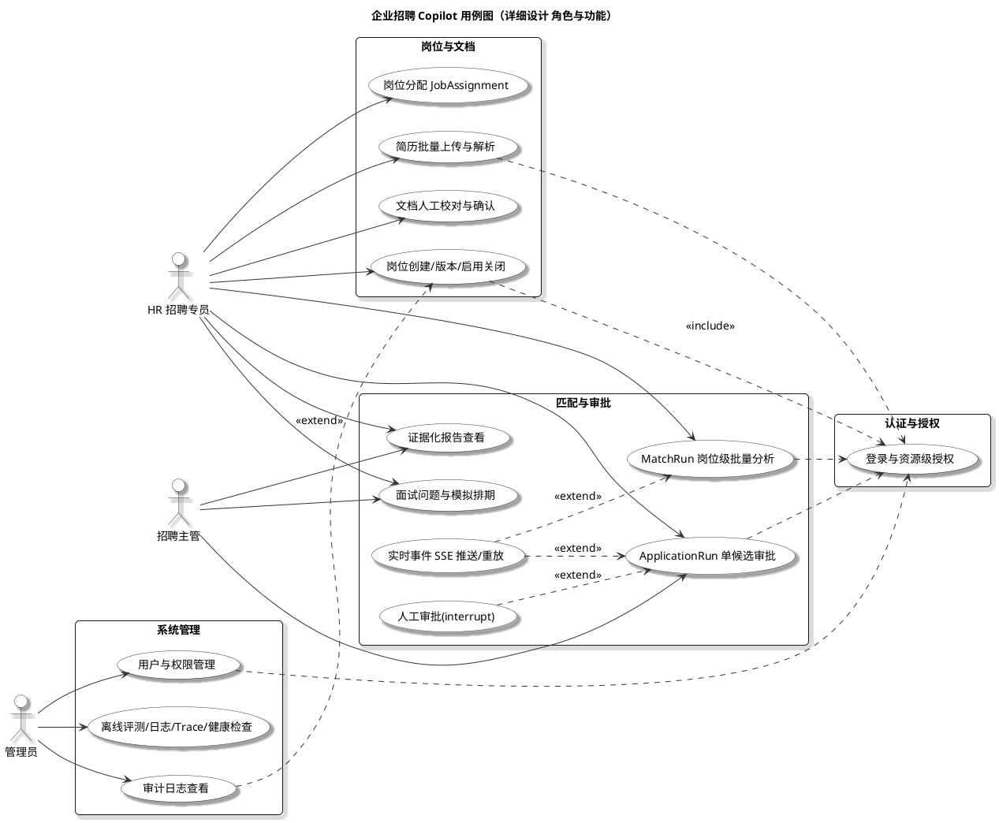

# 企业招聘 Copilot — UML 规划文档

> 配套文档：《详细设计说明书 v1.0》
> 参考标准：《掌握14种UML图，清晰图示》（CSDN）中定义的 UML 关系符号与语义。
> 视觉规格：参照参考用例图（actor + 椭圆用例 + 实线关联 / 虚线 include-extend + 底部说明表），统一为白底、宋体、圆角、阴影；**不使用黄色背景**。
> 用途：本文件给出 6 类 UML 图（用例图、类图、包图、活动图、组件图、部署图）的**规划说明**、**PlantUML 源码**与**图例说明表**。
> 生成方式：将每个 ` ```plantuml ` 代码块内 `@startuml ... @enduml` 的内容复制到 https://www.plantuml.com/plantuml/uml 即可渲染。
> 约定：类名/字段名沿用说明书（后端 PascalCase、snake_case 表名），枚举值使用说明书中的字符串枚举。

---

## 1. 总览

| 图 | 目标 | 主要依据章节 | 拆分块数 | 渲染优先级 |
|---|---|---|---|---|
| 用例图 Use Case | 参与者与系统功能边界 | 全篇角色 / 第 6、7、10、11 章 | 1 | 高 |
| 类图 Class | 领域实体、端口（Protocol）、状态对象的静态结构与关系 | 第 4 章、第 2.3、第 10.1、第 11.1 | 3（实体 / 运行 / 端口状态） | 高 |
| 包图 Package | 后端模块划分与依赖方向（依赖倒置） | 第 2.1、第 2.2 | 1 | 高 |
| 活动图 Activity | 4 条核心业务流程 | 第 7.2、第 10.2、第 11.2、第 13.3 | 4 | 高 |
| 组件图 Component | 运行时构件提供的/需要的接口及依赖 | 第 14、第 20、整体架构 | 1 | 中 |
| 部署图 Deployment | 软件构件如何分布到不同节点（软硬件映射） | 第 20.1 | 1 | 中 |

### 1.1 统一视觉规格（依据参考用例图，不含黄色背景）

所有图统一以下 `skinparam`（已内联到每个代码块，复制单个图即可生效）：

```plantuml
' ===== 统一风格配置（白底 / 宋体 / 圆角 / 阴影，对应参考用例图）=====
skinparam defaultFontName 宋体
skinparam defaultFontSize 14
skinparam shadowing true
skinparam roundCorner 10
skinparam classAttributeIconSize 0
skinparam backgroundColor #FFFFFF
skinparam classBackgroundColor #FFFFFF
skinparam classBorderColor #333333
skinparam packageBackgroundColor #FFFFFF
skinparam packageBorderColor #333333
skinparam componentBackgroundColor #FFFFFF
skinparam componentBorderColor #333333
skinparam nodeBackgroundColor #FFFFFF
skinparam nodeBorderColor #333333
skinparam databaseBackgroundColor #FFFFFF
skinparam databaseBorderColor #333333
skinparam activityBackgroundColor #FFFFFF
skinparam activityBorderColor #333333
skinparam arrowColor #333333
```

### 1.2 关系符号语义（对照参考文章）

| 关系 | 语义 | 符号 | PlantUML 语法 | 本文使用位置 |
|---|---|---|---|---|
| 泛化 | 继承 | 三角**实线** | `父类 <|-- 子类` | 类图 A 实体继承；类图 C 端口实现用 `<|..` |
| 实现 | 类实现接口 | 三角**虚线** | `接口 <|.. 实现类` | 类图 C 适配器实现端口 |
| 关联 | 拥有（成员变量） | **实线**箭头 | `A --> B` | 类图 A/B 引用关系 |
| 聚合 | 整体-部分，部分可独立 | 空心菱形**实线** | `整体 o-- 部分` | 类图 A `Job o-- JobAssignment` |
| 组合 | 整体-部分，部分不可独立 | 实心菱形**实线** | `整体 *-- 部分` | 类图 B 运行/报告/Claim/事件等 |
| 依赖 | 使用（需协助） | **虚线**箭头 | `A ..> B` | 包图依赖；组件图构件→数据库 |

> 实线（泛化/关联/聚合/组合）与虚线（实现/依赖/include/extend）严格区分，对应参考用例图中实线与虚线的用法。

---

## 2. 类图（Class Diagram）

### 2.1 规划说明

领域模型按聚合拆成 3 个图，避免单图过载：
- **类图 A — 主聚合**：用户、岗位、岗位版本、岗位分配、简历文档、候选人、候选人档案、证据块、岗位申请。
- **类图 B — 运行/报告/审批聚合**：`AgentRun` 基类泛化出 `MatchRun`/`ApplicationRun`；报告、Claim、证据引用、审批、状态历史、面试、事件。
- **类图 C — 端口与状态**：以 `interface`（Protocol）与 `TypedDict` 状态对象呈现，体现依赖倒置。

### 2.2 PlantUML 源码

#### 类图 A — 主聚合



**图例说明**

| 元素 | 说明 |
|---|---|
| `AggregateRoot` | 业务聚合根抽象基类（UUID / 时间戳 / 乐观锁 version） |
| `User / Job / ResumeDocument / Candidate / CandidateProfile / JobApplication` | 6 个核心聚合根实体 |
| `JobVersion` | 岗位版本，**组合**于 `Job`（脱离岗位无意义） |
| `JobAssignment` | 岗位分配，**聚合**于 `Job`（可独立审计，revoked_at 软删） |
| `CandidateProfile / EvidenceChunk` | 由文档解析出的候选人档案与证据块 |
| `Role / JobStatus / DocumentStatus / ProfileStatus / ApplicationStatus` | 字符串枚举，数据库与代码共同维护 |

#### 类图 B — 运行 / 报告 / 审批聚合



**图例说明**

| 元素 | 说明 |
|---|---|
| `AgentRun` | 运行基类（泛化出 `MatchRun` / `ApplicationRun`），承载幂等/状态机 |
| `MatchRun` / `MatchRunCandidate` | 岗位级批量分析运行及候选评分（**组合**） |
| `ApplicationRun` / `Approval` / `Interview` | 单候选审批运行、人工审批、模拟面试（**组合**） |
| `MatchReport` / `ReportClaim` / `ClaimEvidence` | 证据化报告、claim、证据引用三层组合结构 |
| `ApplicationStatusHistory` | 申请状态变更历史（**组合**，持续授权审计） |
| `AgentEvent` | 运行事件流（**组合**，支持 SSE 重放） |

#### 类图 C — 端口（Protocol）与状态对象

```plantuml
@startuml 类图C-端口与状态
title 企业招聘 Copilot 类图 C：端口(Protocol) / 状态对象 / 配置
skinparam defaultFontName 宋体
skinparam defaultFontSize 14
skinparam shadowing true
skinparam roundCorner 10
skinparam classAttributeIconSize 0
skinparam backgroundColor #FFFFFF
skinparam classBackgroundColor #FFFFFF
skinparam classBorderColor #333333
skinparam packageBackgroundColor #FFFFFF
skinparam packageBorderColor #333333
skinparam arrowColor #333333

interface StorageBackend {
  + put(source, media_type) : StoredObject
  + open(storage_key) : BinaryIO
  + delete_if_unreferenced(storage_key) : void
  + healthcheck() : StorageHealth
}
class LocalVolumeStorage

interface DocumentParser {
  + media_types: frozenset
  + version: str
  + parse(stream, limits) : ParsedDocument
}
class PdfParser
class DocxParser

interface ModelGateway {
  + structured_completion(operation, system_prompt, trusted_context, untrusted_documents, output_schema, timeout_seconds) : ModelResult
}
class QwenModelGateway
class FakeModelGateway

interface ScheduleBackend {
  + create_schedule(command) : ScheduleResult
  + get_by_idempotency_key(key) : ScheduleResult
}
class MockScheduleBackend

interface UnitOfWork {
  + users: UserRepository
  + jobs: JobRepository
  + documents: DocumentRepository
  + candidates: CandidateRepository
  + runs: RunRepository
  + approvals: ApprovalRepository
  + events: EventRepository
  + commit() : void
  + rollback() : void
}

interface Clock {
  + now() : datetime
}
class SystemClock
class FrozenClock

interface IdGenerator {
  + generate() : UUID
}

class MatchRunState {
  + run_id: UUID
  + thread_id: str
  + attempt: int
  + job_id: UUID
  + job_version_id: UUID
  + candidate_profile_ids: list[UUID]
  + completed_candidate_ids: list[UUID]
  + failed_candidate_ids: list[UUID]
  + report_ids: list[UUID]
  + error: RunError
}

class ApplicationRunState {
  + run_id: UUID
  + thread_id: str
  + attempt: int
  + application_id: UUID
  + match_report_id: UUID
  + current_application_version: int
  + action_type: str
  + approval_id: UUID
  + question_set: InterviewQuestionSet
  + interview_id: UUID
  + error: RunError
}

' 实现：适配器类实现端口接口（三角虚线，指向接口）
StorageBackend <|.. LocalVolumeStorage
DocumentParser <|.. PdfParser
DocumentParser <|.. DocxParser
ModelGateway <|.. QwenModelGateway
ModelGateway <|.. FakeModelGateway
ScheduleBackend <|.. MockScheduleBackend
Clock <|.. SystemClock
Clock <|.. FrozenClock
@enduml
```



**图例说明**

| 元素 | 说明 |
|---|---|
| `StorageBackend` / `DocumentParser` / `ModelGateway` / `ScheduleBackend` | 端口（Protocol），领域不依赖其实现 |
| `UnitOfWork` / `Clock` / `IdGenerator` | 事务、时钟、ID 生成端口（可测、可冻结） |
| `*ModelGateway` / `PdfParser` 等 | 具体适配器，**实现**（三角虚线）端口 |
| `MatchRunState` / `ApplicationRunState` | LangGraph `TypedDict` 状态对象（无副作用，可序列化） |

---

## 3. 包图（Package Diagram）

### 3.1 规划说明

严格对应第 2.1 / 2.2 章，按参考文章“包图表示包之间的依赖（虚线）”绘制。所有包间连线统一用**虚线箭头（依赖）**，符合依赖倒置：入口层只依赖领域层应用服务，领域层依赖端口，基础设施反向实现端口，Domain Policy 不依赖任何框架。

### 3.2 PlantUML 源码



**图例说明**

| 元素 | 说明 |
|---|---|
| `apps`（api/worker/scheduler/web） | 入口层，仅依赖领域层应用服务，彼此不依赖 |
| `backend.app` 各子包 | 领域层模块（按业务域划分） |
| `ports` | 端口声明层（Repository / 各类 Gateway / Clock / IdGenerator） |
| `infrastructure` | 适配层，实现 `ports` 中的端口 |
| 虚线箭头 | 依赖方向，箭头指向被依赖的更底层/端口 |

---

## 4. 活动图（Activity Diagram）

### 4.1 规划说明

按参考文章“活动图描述具体业务用例的实现流程”选取 4 条流程。符号约定：`start/stop` 起止、`fork/join` 并行、`if/else` 决策、`<<interrupt>>` 表示 LangGraph 等待人工审批的中断节点（渲染为带构造型节点，不影响正确性）。

**活动图图例说明**

| 符号 | 含义 |
|---|---|
| `start` / `stop` | 流程起点 / 终点 |
| 圆角矩形 `:动作;` | 处理步骤（领域服务或节点调用） |
| `if (?) then / else / endif` | 决策分支 |
| `fork ... fork again ... end fork` | 并行扇出（Candidate 级评估） |
| `-> 节点 <<interrupt>>` | 等待人工审批的中断点 |
| `repeat ... while` / `while ... endwhile` | 循环（重放 / 实时推送） |

### 4.2 PlantUML 源码

#### 活动图 1 — MatchRun 主流程



#### 活动图 2 — ApplicationRun 与人工审批



#### 活动图 3 — 文档上传与解析



#### 活动图 4 — SSE 事件重放

```plantuml
@startuml 活动图-SSE重放
title SSE 事件重放活动图（详细设计 第13.3节）
skinparam defaultFontName 宋体
skinparam defaultFontSize 14
skinparam shadowing true
skinparam roundCorner 10
skinparam backgroundColor #FFFFFF
skinparam activityBackgroundColor #FFFFFF
skinparam activityBorderColor #333333
skinparam arrowColor #333333

start
:认证 Token + 解析 Run + 资源授权;
if (Last-Event-ID 存在?) then (是)
  :查询其 run_id / sequence;
  if (不属于当前 Run?) then (是)
    :返回 400 INVALID_EVENT_CURSOR;
    stop
  else (否)
  endif
else (否)
endif

repeat
  :按 sequence > last ORDER BY sequence LIMIT batch;
  :每批发送前重新 require_run_access;
  :推送事件批次;
repeat while (仍有后续 sequence?) is (是)
-> (追平)

while (Run 未终态?) is (是)
  :等待 Redis 通知 / 心跳轮询;
  :读取数据库新 sequence 并推送;
endwhile (否)

:发出最终心跳;
:关闭 SSE 连接;
stop
@enduml
```

---

## 5. 组件图（Component Diagram）

### 5.1 规划说明

按参考文章“组件图描绘组件提供的、需要的接口、端口等，以及它们之间的关系；依赖用虚线箭头”绘制。用 **ball-and-socket（圆球=提供接口，插槽=需要接口）** 表达契约；数据访问一律用**虚线箭头（依赖）**。

### 5.2 PlantUML 源码



**图例说明**

| 元素 | 说明 |
|---|---|
| `web` | React SPA，需要 `REST/SSE` 接口 |
| `api` | FastAPI 服务，提供 `REST/SSE`，依赖 `pg`/`redis` |
| `worker` | Celery 解析/分析，需要 `ModelGateway`/`StorageBackend` |
| `scheduler` | Celery Beat，仅向 `redis` 发布维护任务 |
| `pg` / `redis` / `storage` | 基础设施（PostgreSQL+pgvector / Redis / 存储卷） |
| `qwen` / `langfuse` | 外部依赖（模型 API / 可选 Trace） |
| 圆球 / 插槽 | 提供接口 / 需要接口 |
| 虚线箭头 | 依赖（构件 → 数据库 / 外部服务） |

---

## 6. 部署图（Deployment Diagram）

### 6.1 规划说明

按参考文章“部署图描述系统内部的软件如何分布在不同的节点上、表示软件和硬件的映射关系”绘制。每个容器是一个 `node`，容器内运行的**进程用 `artifact` 表示**，数据库仍是 `database`；卷挂载用节点表达。严格对齐第 20.1 章 Docker Compose 服务清单。

### 6.2 PlantUML 源码

```plantuml
@startuml 部署图-DockerCompose
title 企业招聘 Copilot 部署图（详细设计 第20.1章 Docker Compose）
skinparam defaultFontName 宋体
skinparam defaultFontSize 14
skinparam shadowing true
skinparam roundCorner 10
skinparam backgroundColor #FFFFFF
skinparam nodeBackgroundColor #FFFFFF
skinparam nodeBorderColor #333333
skinparam databaseBackgroundColor #FFFFFF
skinparam databaseBorderColor #333333
skinparam arrowColor #333333

node "Docker Host" as host {
  node "nginx 容器" as nginx {
    artifact "nginx 反向代理" as nga
  }
  node "web 容器" as webc {
    artifact "web 静态资源" as wea
  }
  node "api 容器" as apic {
    artifact "api 进程 (FastAPI)" as apia
  }
  node "worker 容器" as workerc {
    artifact "worker 进程 (Celery)" as wora
  }
  node "scheduler 容器" as schedc {
    artifact "beat 进程" as sca
  }
  node "postgres 容器" as pgc {
    database "PostgreSQL + pgvector" as pg
  }
  node "redis 容器" as rc {
    database "Redis" as redis
  }
}

node "宿主机挂载" as mount {
  [postgres-data 卷]
  [redis-data 卷]
  [storage 卷]
}

nginx --> webc : 静态
nginx --> apic : /api 反向代理
apia --> pg : SQL
apia --> redis : Pub/Sub + Broker
wora --> pg : SQL
wora --> redis : Broker
sca --> redis : 发布维护任务
pgc --> postgres-data 卷
rc --> redis-data 卷
apia --> storage 卷
wora --> storage 卷

note bottom of host
  api/worker/scheduler 同镜像、同配置 Schema；
  Alembic migrate 为一次性命令，不自动并发迁移
end note
@enduml
```

**图例说明**

| 元素 | 说明 |
|---|---|
| `nginx / web / api / worker / scheduler` | 容器节点，内部 `artifact` 为运行进程 |
| `postgres / redis` | 数据库容器节点 |
| `postgres-data / redis-data / storage` | 持久化卷（宿主机挂载） |
| 实线关联 | 反向代理 / SQL / Pub-Sub / 卷挂载 映射 |
| 同镜像约束 | api/worker/scheduler 共用镜像与配置 Schema |

---

## 7. 用例图（Use Case Diagram）

### 7.1 规划说明

按参考用例图规格绘制：actor 小人 + 椭圆用例 + **实线关联**（参与者-用例）+ **虚线 `<<include>>`**（被包含的公共子流程，如登录授权）+ **虚线 `<<extend>>`**（可选扩展，如人工审批、SSE 推送）。按说明书中的三类参与者与核心功能边界组织，矩形分组对应"认证/岗位文档/匹配审批/系统管理"四区。

### 7.2 PlantUML 源码



**图例说明**

| 参与者 | 职责 |
|---|---|
| `HR 招聘专员` | 岗位配置与分配、简历上传解析、触发 MatchRun、执行候选审批与排期 |
| `招聘主管` | 查看证据化报告、参与候选审批与录用决策 |
| `管理员` | 用户权限、系统配置、离线评测、审计合规 |

| 符号 | 含义 |
|---|---|
| 实线 | 参与者与用例的关联 |
| 虚线 `<<include>>` | 公共被包含子流程（如登录与资源级授权） |
| 虚线 `<<extend>>` | 可选扩展（人工审批 interrupt、SSE 实时推送/重放、审计查看） |

---

## 8. 使用说明

1. 打开 https://www.plantuml.com/plantuml/uml 。
2. 将任一 ` ```plantuml ` 代码块中 `@startuml ... @enduml` 的**全部内容**粘贴进文本框（含首尾两行与内联的 `skinparam`）。
3. 类图 A/B/C 可分别在三个标签页渲染，避免单图过载；如需合并，可把三个 `@startuml` 块按顺序拼接（去掉中间多余的 `@enduml/@startuml`），但图会非常拥挤，**不推荐**。
4. 视觉风格：所有图已统一为白底、宋体、圆角、阴影，与参考用例图一致（不含黄色背景）。
5. 实线（泛化/关联/聚合/组合）与虚线（实现/依赖/include/extend）严格区分，便于阅读。
6. 活动图中的 `<<interrupt>>` 仅为语义标注（表达 LangGraph 等待人工审批），渲染为带构造型节点，不影响正确性。
7. 字段为示意级（关键字段），实现前以说明书第 4 章表结构为准；如需更完整字段，按图 A/B/C 的字段列表逐一补充即可。

---

_本规划文档与《详细设计说明书 v1.0》同源，依据《掌握14种UML图，清晰图示》的符号标准统一关系画法，并按参考用例图的视觉规格（白底 / 宋体 / 圆角 / 阴影 / 底部图例表）统一呈现。六类图覆盖：功能边界（用例图）、领域静态结构（类图）、模块依赖（包图）、核心流程（活动图）、运行时构件接口与依赖（组件图）、运行拓扑（部署图）。_
